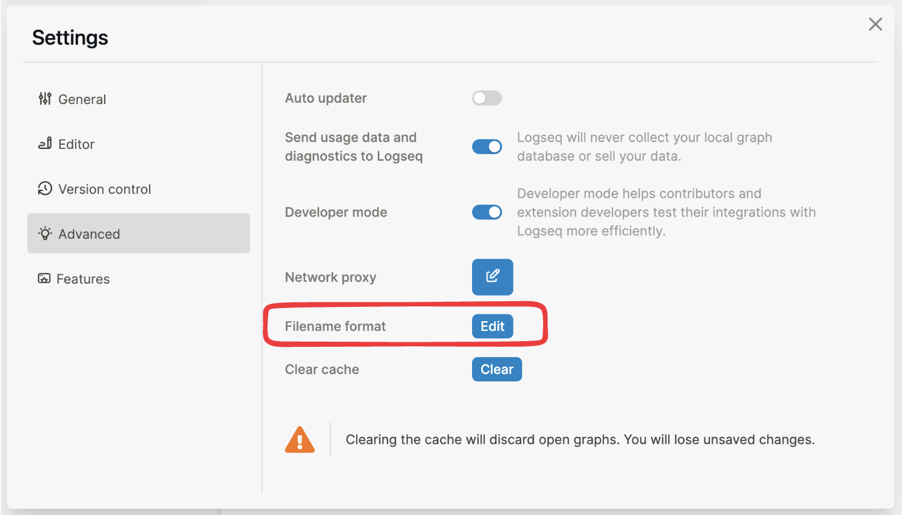
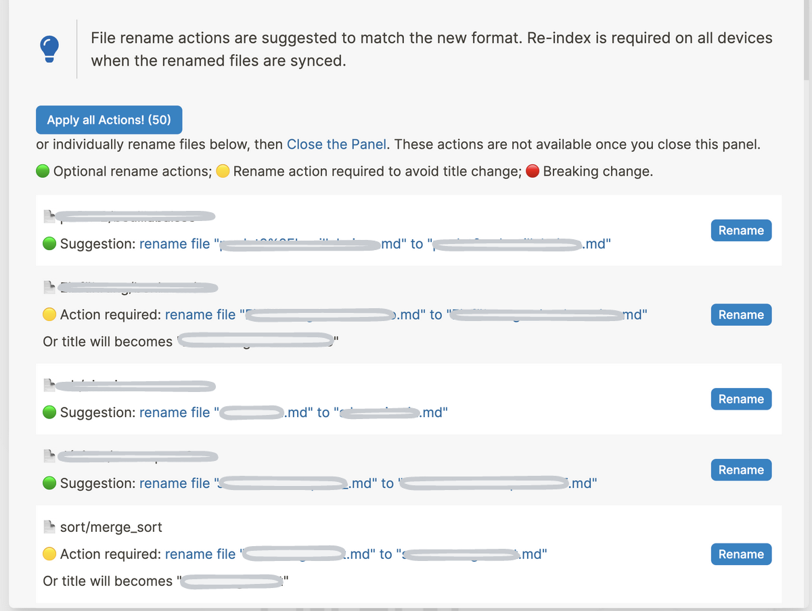
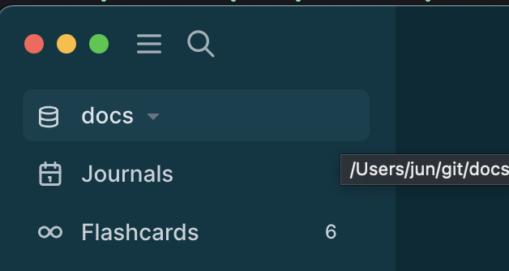
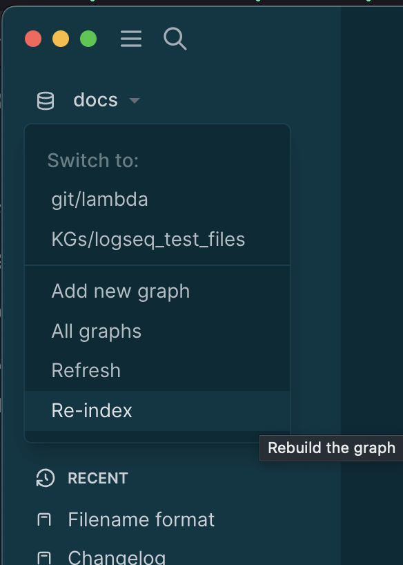

type:: [[Feature]]
platform:: [[Desktop]]
description:: Allow users to migrate the filenames to the latest format
initial-version:: 0.8.9

- #+BEGIN_IMPORTANT
  Make sure all Logseq clients on your devices are upgraded to `0.8.9` or above when you are going to apply the new filename format (`:triple-lowbar`). 
  Newly created graphs on Logseq `0.8.9` or above are also using the new filename format by default. May [restore the legacy format](((63503015-99b5-4186-9c42-d3ab9c82482b))) to keep compatible with old Logseq versions.
  Opening graphs in new filename format with earlier versions of Logseq will wrongly display some page titles and break some page references. AVOID creating or renaming pages on these graphs with old versions of Logseq (e.g. Logseq `0.8.2` on iOS until the upgrade is released)
  #+END_IMPORTANT
- ## Usage
  id:: 634fae2e-edab-42e0-8385-59df3fc3da0e
	- You may find the `Filename format` setting since Logseq `0.8.9`
		- 
	- This setting configures how a page **in the current graph** is stored to a file
		- Only upgrade to the latest format is available.
	- To change the config, click the `Edit` button and follow the instructions in the pop-up `Filename format` panel to convert your files.
		- #+BEGIN_WARNING
		  **Backup** all your notes somewhere else **first** before continue 
		  #+END_WARNING
		  #+BEGIN_IMPORTANT
		  There's a **point of no-return** by clicking the button `Update format`. Preview the required changes to the existing filenames beforehand
		  #+END_IMPORTANT
		- 
		- Also refer: ((634fb104-f332-4743-904a-4827ee754bfc))
	- #+BEGIN_IMPORTANT
	  Remember to re-index the graph on **ALL clients** once all the files are renamed and synced!
	  ((63500411-87b0-4d62-a9ac-5b5418bc3201))
	  #+END_IMPORTANT
## Functionality
	- **What is a `Filename format`?**
		- In Logseq, every page is stored as an individual file on your computer, which uses the page title as the filename.
		- However, while some special characters like `/` and `?` are frequently used in page titles, they are invalid for filename on some operating systems. Hence, we need a way to encode these special characters into filenames and decode them back to page titles, what we call `filename format`.
		- The previous `filename format` Logseq used to treat page titles is `:legacy`. Since `0.8.9`, Logseq introduces `:triple-lowbar` as the new `filename format` with better readability, compatibility, and less ambiguity.
		- `Filename format` is a per-graph setting, and would be synced to the same graph on other clients if you have sync service setup
	- **FIlename format explain**
		- `:legacy`
		  id:: 634fb9a8-cab9-441e-b476-41fa828010ea
			- Use Percent-encoding for `/` and other invalid characters
			- For some earlier versions of Logseq, use `.` to encode `/` instead of Percent-encoding (`%2F`); use `_` to encode special characters
			- Decode `.` in the file name as slash `/` in the page title for backward compatibility
			- Add `title::` properties ([[custom page title]]) to pages with encoded characters to avoid ambiguity
		- `:triple-lowbar`
		  id:: 634fb9b1-7a77-4666-9235-bc5cf27c8fd4
			- Use triple underscore `___` for slash `/` in the page title for better readability
			- Use Percent-encoding for other invalid characters
			- No more `title::` property required (you can still use `title::` property manually
	- **Where is the `Filename format` config stored?**
	  id:: 634fb3ee-cef0-4081-9085-c002d3be4e75
		- #+BEGIN_WARNING
		  Changing the filename format option of an existing graph from `config.edn` is not recommended. Should access the setting `Filename format` and follow the instructions 
		  #+END_WARNING
		  `Filename format` is a per-graph setting. It is stored in [[config.edn]], with key `:file/name-format`, for example:
		  ```clojure
		  :file/name-format :triple-lowbar
		  ```
		- There are two available values, `:legacy` and `:triple-lowbar`
			- The default value for new graphs created since `0.8.9` is `:triple-lowbar`
			- If your `config.edn` has no such key provided (e.g., comes from an earlier version of Logseq), the default value will be `:legacy`
		- If you want to make an empty new graph compatible with earlier versions of Logseq:
		  id:: 63503015-99b5-4186-9c42-d3ab9c82482b
			- #+BEGIN_WARNING
			  Only do this when the graph is newly created!
			  #+END_WARNING
			  Edit the value of key `:file/name-format` in [[config.edn]] to `:legacy`
			  ```clojure
			  :file/name-format :legacy
			  ```
			- [Re-index Logseq](((63500411-87b0-4d62-a9ac-5b5418bc3201))) to make the change apply
	- **How does the conversion work?**
	  id:: 634fb104-f332-4743-904a-4827ee754bfc
		- Basically it's to update the `filename format` of your graph from the [`:legacy` filename format](((634fb9a8-cab9-441e-b476-41fa828010ea))) to the beautiful new [`:triple-lowbar` filename format](((634fb9b1-7a77-4666-9235-bc5cf27c8fd4)))
		- #+BEGIN_WARNING
		  **Backup** all your notes somewhere else **first** before continue 
		  #+END_WARNING
		  #+BEGIN_IMPORTANT
		  There's a **point of no-return** by clicking the button `Update format`. Preview the required changes towards the existing filenames beforehand
		  #+END_IMPORTANT
		- By clicking into the `Filename format` panel from settings, you may find the `Update format` button and preview the required renaming actions on switching to the new format.
			- Once you click the `Update format` button, the `Filename format` setting of the current graph will be updated. Logseq will treat the graph with the new `filename format` after you leave the panel. So this is a **point of no return**
			- Also refer ((634fb3ee-cef0-4081-9085-c002d3be4e75))
		- After you click the `Update format`, the previously previewed renaming actions will be available.
			- 
			- May rename all the listed files via the `Apply all Actions!` button or rename files individually via clicking the `Rename` buttons on the right-hand side.
			- For the meaning of the 🟢 🟡 🔴 indicators of the listed files, please refer ((634fe449-cecc-4b82-9cb5-3bbb01fd7d98))
		- #+BEGIN_IMPORTANT
		  Remember to re-index the graph on **ALL clients** once all the files are renamed and synced!
		  ((63500411-87b0-4d62-a9ac-5b5418bc3201))
		  #+END_IMPORTANT
	- **Rename Indicators Explain**
	  id:: 634fe449-cecc-4b82-9cb5-3bbb01fd7d98
		- 🟢 means the renaming is **optional**
			- The page name **won't be changed** in the new format without operation, but renaming the file to follow the new format is suggested.
			- Mostly happens when the page contains a `title::` property that created under the [`:legacy` filename format](((634fb9a8-cab9-441e-b476-41fa828010ea))), renaming will improve the readability of the filename
			- Pages with manually edited `title::` property ([[custom page title]]) **will not be listed**.
			- **Example:** Under `:legacy` format, page `Logseq/Features` contains
			  > title:: Logseq/Features
			  
			  with filename `Logseq%2FFeatures.md`. It will show up as an optional rename action to rename the file to `Logseq__Features.md`
		- 🟡 means the renaming is **required**
		  id:: 634fd550-3ce9-4c5c-88e0-37d45007d6c8
			- The page name **will be changed** in the new format without operation unless you rename the file according to the new filename format.
			- Mostly happens when the filename contains characters like `/`, `?`, `!`, `_`, `.` under the [`:legacy` filename format](((634fb9a8-cab9-441e-b476-41fa828010ea))), and no `title::` property provided in the corresponding page
				- maybe caused by manual deletion, or the file is imported externally
			- **Example:** Under an earlier version of Logseq, page `Logseq/Features` is stored in a file with the name `Logseq.Features.md`, and has no `title::` property provided for some reason. Rename is required to keep the page title as `Logseq/Features`. Otherwise the page title will become `Logseq.Feature` under the `:triple-lowbar` format.
		- 🔴 means breaking change happens without available renaming
			- This is an uncommon case for updating filename format (from `:legacy` to `:triple-lowbar`)
- ## FAQ
	- **Is the filename conversion mandated?**
		- No. You can keep using the old `:legacy` format. But the new `:triple-lowbar` format provides you:
			- More readable filenames (especially, no more `%2F` in the filename for namespace pages).
				- **Example**: For page `Logseq/Features`, the corresponding filename will be changed from `Logseq%2FFeatures.md` to `Logseq___Features.md`
			- No more [auto-generated](((634faa53-1294-4fc8-8343-e2edc39eb755))) `title::` property required
	- **Why some of the files are not listed in the `Filename format` panel**
		- Please confirm the current `Filename format` setting of your graph via ((634fb3ee-cef0-4081-9085-c002d3be4e75)).
		- If your current format is `:triple-lowbar`, it mostly happens when you click `update format` and close the panel without renaming the files.
			- May recover the backup-ed graph and [redo the conversion](((634fb104-f332-4743-904a-4827ee754bfc)))
		- Otherwise, if your current format is `:legacy`, and some of the files with special characters are not listed, most likely they have [[custom page title]] setup, which is not generated automatically under [`:legacy` filename format](((634fb9a8-cab9-441e-b476-41fa828010ea))).
	- **Why some non-expected renaming actions listed**
		- Very likely the listed pages belongs to [this case](((634fd550-3ce9-4c5c-88e0-37d45007d6c8))). The rename actions are inferred based on the `:legacy` filename format, which might come to an unwanted result if no `title::` property is provided.
		- May skip these renamings when happens.
	- **How to re-index a graph?**
	  id:: 63500411-87b0-4d62-a9ac-5b5418bc3201
		- The entrance is on the [[Left sidebar]], in the graph dropdown menu by clicking the button `<Your graph name>`
		- {:height 167, :width 312}
		- {:height 420, :width 285}