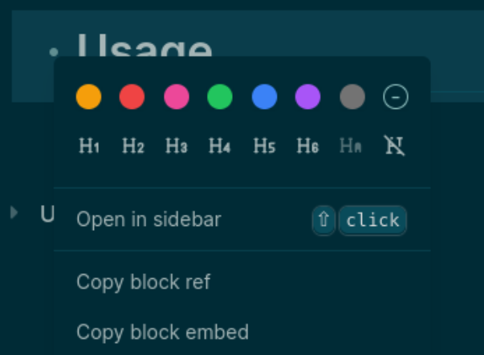

- There are multiple ways to create a heading. You can use markdown syntax while editing a block, by adding `#` signs at the beginning of the, block followed by a space character. The heading level will be based on the number of signs that you used. For example, `### Title` will be translated into an `<h3>`.
- You can also use the context menu to convert a block to a heading, or remove it.
  
- An auto-heading (`HA`) option is also available on the context menu. If you set the heading level to auto, the heading will be based on the nesting level of the block. This can be extremely helpful when we want to format existing pages, because it automatically handles the heading hierarchy.
- Note that there are only six supported heading levels , even when you use the auto-heading option.