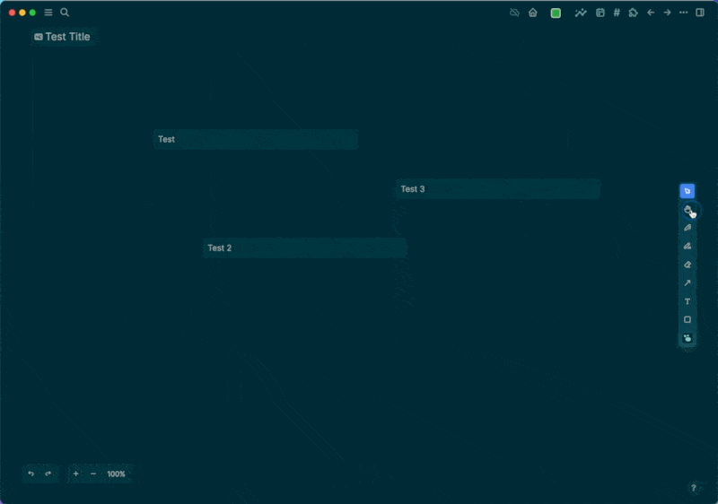
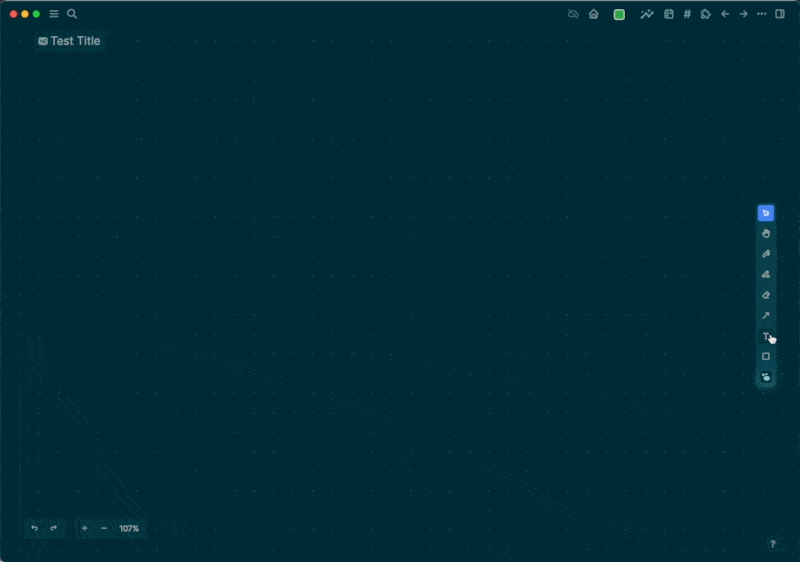
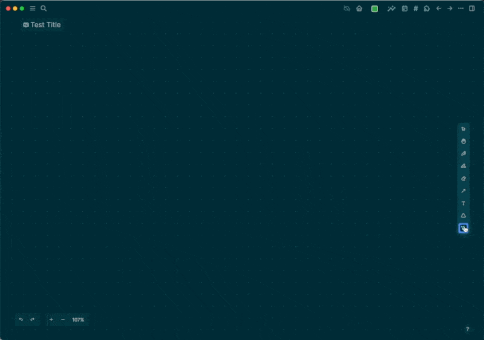
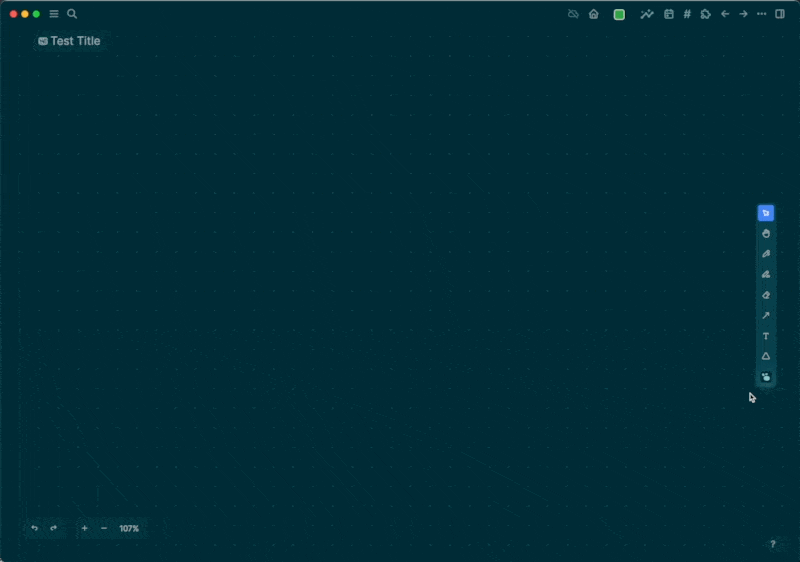
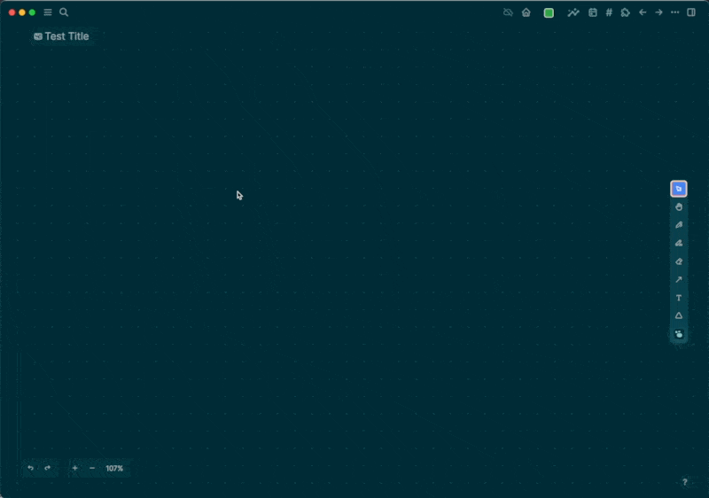
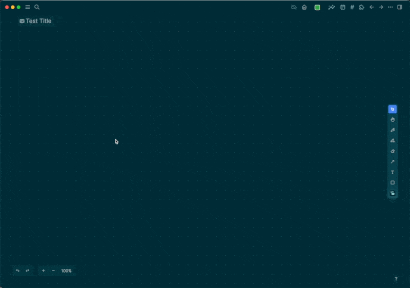

type:: [[Feature]]
description:: Put thoughts from your knowledge base as well as new ones next to each other on a spatial canvas together with shapes, drawings, website embeds and connectors
platform:: [[Desktop]]
alias:: Whiteboards

- #+BEGIN_NOTE
  This feature is not available on a stable release yet as it is currently in alpha. It can only be downloaded separately by alpha testers.
  #+END_NOTE
- # Usage
	- [[Whiteboards]] is a toggleable feature that can be activated in [[Settings]] under the `Features` tab.
	  collapsed:: true
		- 
	- Once activated the [[Whiteboard]] feature can primarily be reached via the [[Left sidebar]] with a new menu item called `Whiteboards`.
	  collapsed:: true
		- {:height 402, :width 326}
	- New whiteboards can currently be created in 3 different ways:
		- [[Whiteboard/Dashboard]]
			- The tile in the top left of the dashboard grid always allows you to create a new whiteboard.
				- 
		- [[Create]] Button
			- After clicking the button labeled `Create` you can choose between creating `New page` or ^^New whiteboard^^. Choosing the latter will open a new whiteboard canvas. This should also be possible with a keyboard shortcut like `n``w`.
				- 
				  id:: 6380a818-1a69-46f1-85f0-2b86fcba9b70
		- [[Search]]
			- After triggering the Search window with `Cmd``K` you can start typing a whiteboard name and select the second entry from the top: `New whiteboard: …`. This will create a new whiteboard canvas with the typed input as the title.
				- 
	- Once you created a whiteboard you should be presented with an empty canvas. These are some of the things you can do:
	  collapsed:: true
		- You can give your Whiteboard a [[Title]] by clicking in the input field in the top left corner.
			- 
			  id:: 6380a818-a9dc-45ac-934b-fc3064509304
		- You can use the [[Toolbar]] to interact with the canvas and add things to it. Currently the following things are possible:
			- [[Toolbar/Select]]
				- Select things on the canvas
					- 
			- [[Toolbar/Move]]
				- Move around the canvas
					- 
			- [[Toolbar/Draw]]
				- Do freeform pencil drawings on the canvas
					- 
			- [[Toolbar/Highlight]]
				- Do freeform highlighting on the canvas
					- 
			- [[Toolbar/Eraser]]
				- Erase any element on the canvas
					- 
			- [[Toolbar/Connector]]
				- Connect any element on the canvas with a line. Add arrows to signal a direction. Add text on the connector. Can also be used to draw lines that are not connected to anything.
					- 
			- [[Toolbar/Text]]
				- 
			- [[Toolbar/Shapes]]
				- Create rectangle, circle and triangle shapes on the canvas
					- 
			- [[Toolbar/Logseq Portal]]
				- Find existing or create new blocks/pages and place on the canvas
					- Create a new Whiteboard block
						- 
					- Create a new page
						- 
					- Find an existing block
						- 
					- Find an existing page
						- 
- # Functionality
	- Logseq [[Whiteboards]] are local-first like the rest of the software.
	  collapsed:: true
		- Once you create your first Whiteboard, you will find a new folder in your graphs folder structure called `whiteboards`. All the whiteboards you create will be saved there as `.edn` files. While there is other ways of [[Whiteboard/Deletion]] you can also always delete them through your file system, by removing the respective `.edn` files.
			- 
		- Whiteboards can be understood as a special type of pages. You can find them in-app in the [[Whiteboard/Dashboard]] as well as [[All pages]].
	- Currently [[Whiteboard embeds]] only work in rudimentary fashion. We plan to expand this functionality in later versions of [[Whiteboards]].
	  collapsed:: true
		- When referencing a [[Whiteboard]] in the outliner by it's [[Title]] you will see Whiteboard icon show up at the front of the link. Hovering that link shows you an abstracted preview of the whiteboard.
			- 
		- Once you do a [[Page embed]] of a [[Whiteboard]] you will see the abstracted preview of the whiteboard canvas immediately in the block.
			- 
- # Background
	- What makes Logseq's [[Whiteboards]] unique is the combination of the Outliner with a spatial canvas. Thanks to [[Logseq Portal]]s you will be able to visually group and link different blocks and pages from your knowledge base as well as external media types (YouTube, Images, Websites) and simple shapes. This allows visual thinkers to compose, remix, annotate and relate contents from their knowledge base as well as emerging thoughts in a new way.
- # Additional Links
- TODO [[Jakob]] to fill out this page #docs
	- NOW [[Toolbar]]
	  :LOGBOOK:
	  CLOCK: [2022-11-25 Fri 12:40:46]
	  :END:
	- DONE [[Whiteboard/Object/Action Bar]]
	- DONE [[Whiteboard/Object]]
	  :LOGBOOK:
	  CLOCK: [2022-11-25 Fri 17:12:12]--[2022-11-25 Fri 17:12:13] =>  00:00:01
	  :END:
	- DONE [[Title]]
	  :LOGBOOK:
	  CLOCK: [2022-11-25 Fri 12:40:53]--[2022-11-25 Fri 12:57:46] =>  00:16:53
	  :END:
	- NOW [[Whiteboard/Quick Add]]
	  :LOGBOOK:
	  CLOCK: [2022-11-25 Fri 17:13:07]
	  :END:
	- [[Whiteboard/Canvas]]
	- [[Whiteboard/Canvas/View]]
	- [[Whiteboard/Dashboard]]
	- [[Context Menu]]
	- [[Whiteboard/Embeds]]
	- [[Whiteboards/Object/Links]]